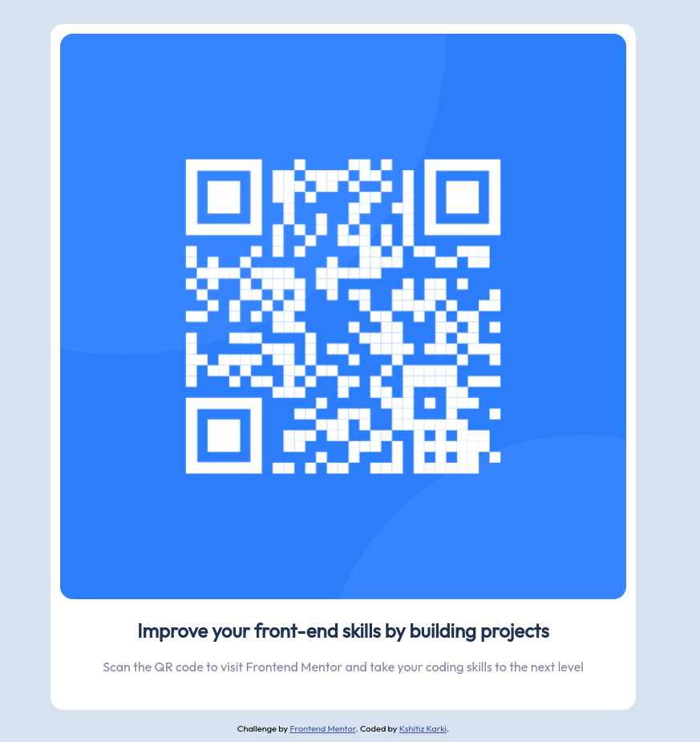

# Frontend Mentor - QR code component solution

This is a solution to the [QR code component challenge on Frontend Mentor](https://www.frontendmentor.io/challenges/qr-code-component-iux_sIO_H). Frontend Mentor challenges help you improve your coding skills by building realistic projects.

## Table of contents

-   [Overview](#overview)
    -   [Screenshot](#screenshot)
    -   [Links](#links)
-   [My process](#my-process)
    -   [Built with](#built-with)
    -   [What I learned](#what-i-learned)
    -   [Continued development](#continued-development)
    -   [Useful resources](#useful-resources)
-   [Author](#author)

**Note: Delete this note and update the table of contents based on what sections you keep.**

## Overview

### Screenshot



### Links

-   Solution URL: [Add solution URL here](https://your-solution-url.com)
-   Live Site URL: [Add live site URL here](https://your-live-site-url.com)

## My process

### Built with

-   Semantic HTML5 markup
-   Flexbox

### What I learned

Centering an HTML element using flexbox which was confusing when i first learned about it.

```
body {
  text-align: center;
  background-color: hsl(212, 45%, 89%);
  font-family: 'Outfit';
  font-size: 1rem;
  height: 100vh;
  display: flex;
  flex-direction: column;
  justify-content: center;
  align-items: center;
}

```

### Continued development

Would like to add a link to my portfolio for below:-
`Coded by <a href="#">Kshitiz Karki</a>.`

### Useful resources

-   [HTML](https://www.youtube.com/watch?v=mJgBOIoGihA) - Helped me a lot to understand about HTML semantics and best practices.
-   [CSS](https://www.youtube.com/watch?v=n4R2E7O-Ngo&t=24752s) - Beginner friendly tutorial that introduced me to the some important topics in CSS.
-   [Flexbox froggy](https://flexboxfroggy.com/) & [Flexbox defense](http://www.flexboxdefense.com/) - Fun & easy way to understand flexbox concepts.

## Author

-   Website - [Kshitiz Karki](https://www.your-site.com) (site to be updated later)
